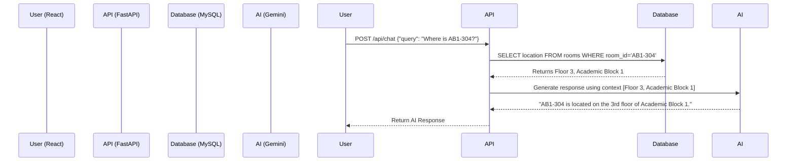

# System Architecture & Design

## 8. System Architecture
CampusConnect AI follows a modern 3-tier architecture:
1.  **Client Tier (Frontend):** React + Tailwind CSS (Vite). Hosted on Vercel/Netlify. Communicates via REST APIs.
2.  **Application Tier (Backend):** Python + FastAPI. Hosted on AWS EC2 or Render. Handles business logic, navigation graph computation, and AI prompt engineering.
3.  **Data Tier (Database & AI):** 
    *   **MySQL:** Stores user data, faculty info, locations, and events.
    *   **Gemini API:** Processes natural language queries using context injected by the backend.

## 12. Navigation Engine Design
**Algorithm:** A* (A-Star) Search Algorithm or Dijkstra's Algorithm.
**Graph Modeling:**
*   **Nodes:** Represent intersections, room entrances, staircases, and elevators.
*   **Edges:** Represent the walkable path between two nodes.
*   **Weights:** Distance (in meters) or estimated walking time.
*   **Floor Transitions:** Staircase/Elevator nodes have edges connecting them to the same (X, Y) coordinate node on the floor above/below, with a higher weight (time penalty).

## 13. AI Assistant Design (RAG Implementation)
**Engine:** Google Gemini API.
**Architecture:** Retrieval-Augmented Generation (RAG).
1.  **User Input:** "Where is Dr. Ramesh's cabin?"
2.  **Intent Classification:** Backend classifies as `LOCATION_QUERY`.
3.  **Database Lookup:** Backend queries MySQL: `SELECT cabin, department FROM faculty WHERE name LIKE '%Ramesh%'`.
4.  **Prompt Injection:** Backend sends to Gemini: `"Context: Dr. Ramesh is in Cabin AB1-204, Computer Science Dept. User asks: Where is Dr. Ramesh's cabin? Answer concisely."`
5.  **Output:** Gemini generates a conversational, accurate response.

## 14. Security Considerations
*   **API Security:** FastAPI backend protected with JWT (JSON Web Tokens) for authenticated routes.
*   **Rate Limiting:** Implement rate limiting on the AI chat endpoint to prevent Gemini API quota exhaustion.
*   **SQL Injection Prevention:** Use SQLAlchemy (ORM) to sanitize all database inputs.
*   **Data Privacy:** Faculty contact details and student data strictly access-controlled.

## 23. Use Case Diagram
```mermaid
usecaseDiagram
    actor Student
    actor Faculty
    actor Admin

    Student --> (Ask AI Assistant)
    Student --> (Navigate Campus)
    Student --> (View Events/Notices)
    Student --> (Search Faculty)

    Faculty --> (Update Office Hours)
    Faculty --> (Post Notice)

    Admin --> (Manage Campus Map Nodes)
    Admin --> (Manage Users)
```

## 24. System Flow Diagram

